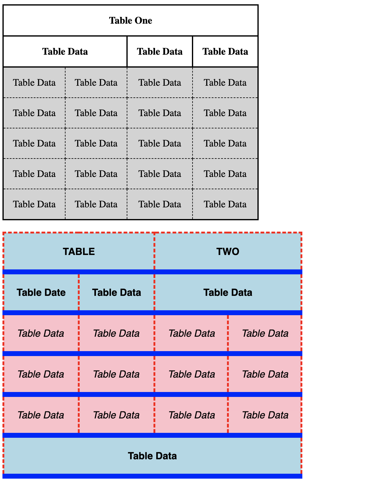
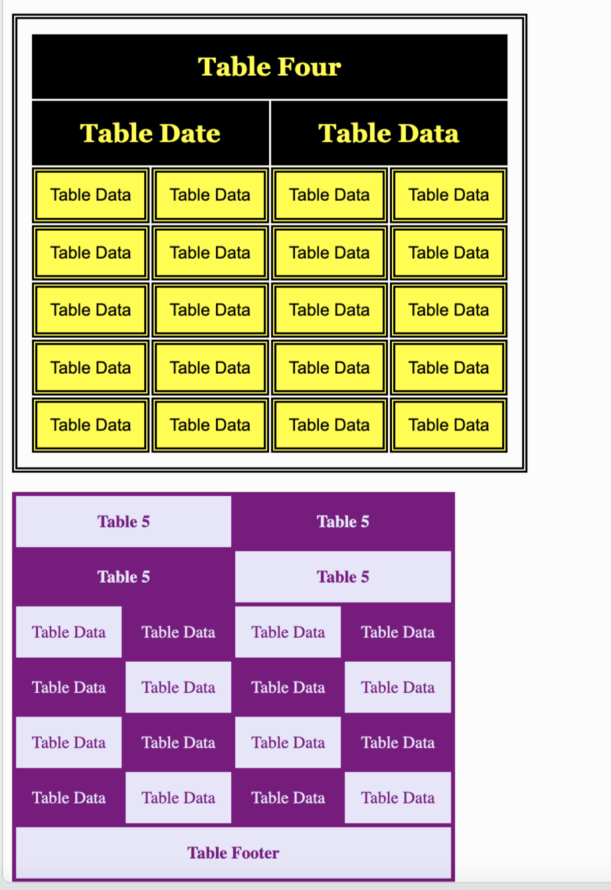

# Tables Quiz

Use CSS to make the tables on the HTML page look similar to the tables pictured below. Including border style and text and vertical alignment. Try different border width until you find one that matches closest.

**TABLE FIVE IS AN EXTRA CREDIT CHALLENGE (5pts)**:

The first table has a hover function.  The hover color is aqua:

Table One colors are: black and lightgray 
Table Two colors are: lightblue, pink, red and blue 
Table Three colors are: green, lightgreen and white 
Table Four colors are: black and yellow 
Table Five colors are: purple and lavender 

Below is reference links for other ways to style tables using CSS:

[CSS Table Borders](https://www.w3schools.com/css/css_table.asp)

[CSS Table Size](https://www.w3schools.com/css/css_table_size.asp)

[CSS Table Align](https://www.w3schools.com/css/css_table_align.asp)

[CSS Table Style](https://www.w3schools.com/css/css_table_style.asp)

[CSS Table Border styles](https://www.w3schools.com/html/html_table_borders.asp)